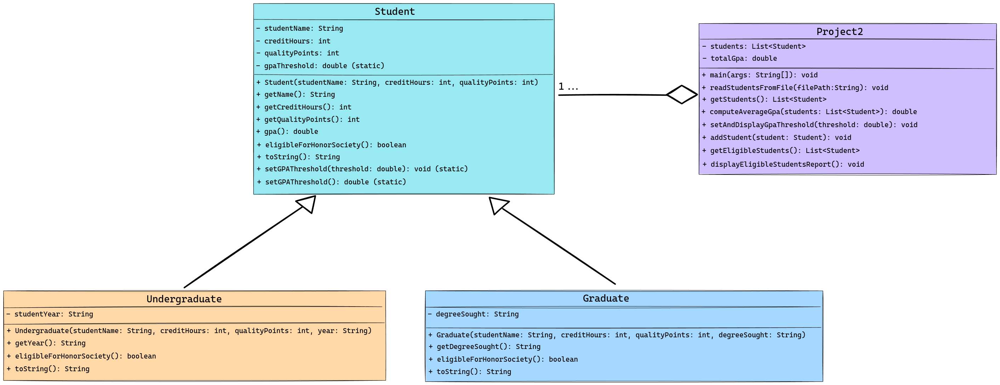

<!-- Title -->
<h1 align="center">Academic Honor Society Evaluator (MAKEFILE VERSION)</h1>

<i>This Java program is designed to assess and manage student academic records for honor society eligibility. It reads student data (including name, credit hours, quality points, and year or degree) from a generated students.txt file, then creates appropriate Student, Undergraduate, or Graduate objects. The program calculates the average GPA, sets a dynamic threshold for honor society eligibility, and displays a report listing eligible students. It's structured as a Maven project with separate modules for data generation and core functionality, and includes a suite of JUnit tests for validation.
</i>

---

<h2 align="center">Tech Used 🧰</h2>

<!-- Tech Stack -->

<kbd>
 |  | 
  
  </kbd>

## User Guide 📔

This guide provides instructions on how to set up and run the project using two different methods: Cloning the repository and downloading the project as a ZIP file.

### Prerequisites

Before you begin, ensure you have the following installed:
- Java JDK
- Git (for cloning the repository)

### Option 1️⃣ : Cloning the Repository

1. **Clone the Repository**

   Open your terminal and run the following command to clone the repository: **`git clone git@github.com:sllozier/honor_evaluator_make.git`**

2. **Navigate to the Project Directory**

    Once the repository is cloned, navigate to the project directory: **`cd path/to/secondProject`**

3. **Using the Makefile**

    - To generate text files, compile the project, run tests, and then run the project code (if tests pass), use: **`make all`**

    - To only generate the text files, use: **`make generate_txt_files`**

    - To run tests (this will also generate text files), use:**`make run_tests`**

    - To run the project code (this will also generate text files), use:**`make run_project`**

    - To clean up and remove generated files, use: **`make clean`**

### Option 2️⃣ : Downloading the ZIP File

1. **Download the Project**

    Go to the repository page on GitHub (or relevant hosting service), and click on the **`Download ZIP`** button. Save the ZIP file to your desired location and extract it.

2. **Navigate to the Project Directory**

    Open your terminal and navigate to the extracted project directory: **`cd path/to/extracted/secondProject`**

3. **Using the Makefile**

    Follow the same steps as in **Option 1** for using the Makefile.

---

*Remember to replace **`[repository URL]`** and **`path/to/secondProject`** with the actual URL of your repository and the path to the **`secondProject`** directory in your local system. This guide assumes that the Makefile is located in the **`secondProject`** directory and is set up as previously discussed.*

---

## Lessons Learned

Through the development of the Honor Evaluator program, I learned valuable lessons in software development methodologies, testing strategies, and build automation. Initially opting for a Maven build system, I later transitioned to using a Makefile. This shift not only enhanced my understanding of build automation but also allowed me to appreciate the flexibility and control provided by custom make commands. The creation of the TestRunner class was a deliberate choice to mimic the functionality of JUnit tests, which underscored the importance of structured testing in software development. This endeavor led to writing more Java code, particularly for test cases, enriching my understanding of test-driven development (TDD).

Adopting a TDD approach was a pivotal learning experience. It emphasized the value of writing tests before actual code, ensuring each functionality is purpose-driven and verified. This method proved especially beneficial in clarifying project requirements and maintaining a high standard of code quality. It also highlighted TDD's strengths in collaborative environments, especially when working with developers of varying experience levels on large projects. The process of starting with tests facilitated a deeper comprehension of the problem domain, encouraged incremental development, and fostered a robust codebase that is easier to maintain and extend. Overall, these lessons in choosing appropriate tools, structuring tests akin to JUnit, and employing TDD have profoundly impacted my approach to software development, emphasizing planning, testing, and collaboration.

## Possible Improvements

Reflecting on the development of the Honor Evaluator program, several areas for improvement stand out, influenced by the constraints of time, scope, and an evolving understanding of the project's requirements. One significant enhancement would be the addition of a dynamic user interface, enabling real-time input and modification of student data. This enhancement was not implemented due to the project's initial focus on backend logic and file processing within the given timeframe.

Improving the program's scalability to efficiently handle larger datasets is another potential area for enhancement. Optimizing for performance through more advanced data structures or parallel processing could markedly improve the program's speed and efficiency. Such optimizations were not prioritized during the initial development phase, with the focus being on establishing core functionalities and ensuring correctness.

Lastly, adopting a more modular design from the beginning could facilitate easier future updates and maintenance. While the current structure meets the project's requirements, a more decoupled architecture would improve the code's readability, testability, and extensibility, providing a solid foundation for any subsequent enhancements or modifications. This approach was somewhat limited by the initial project scope and time constraints, highlighting an area for potential improvement in future iterations.

---

### UML Diagram

<b>See Diagram</b>

---

<h2 align="center">Contact Me 🦄</h2>
<!-- Contact Me -->

<kbd>
 |  |  | 
  </kbd>

